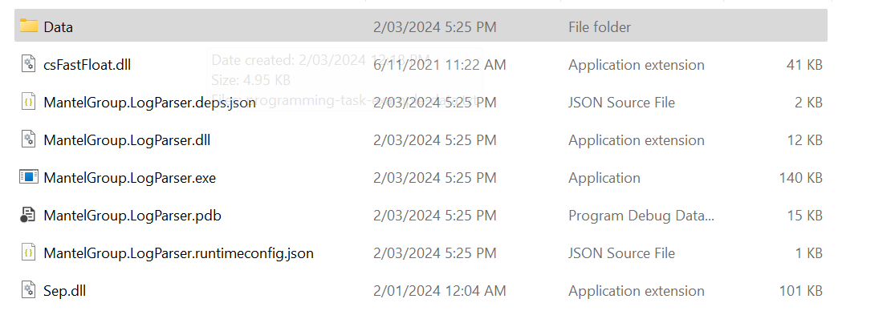
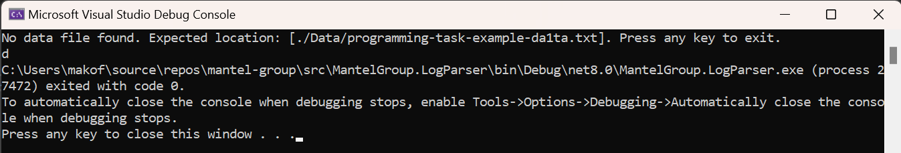
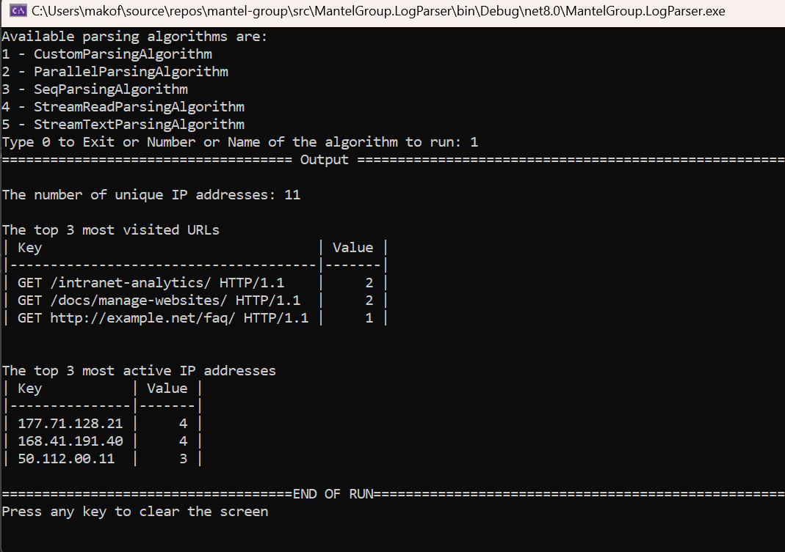
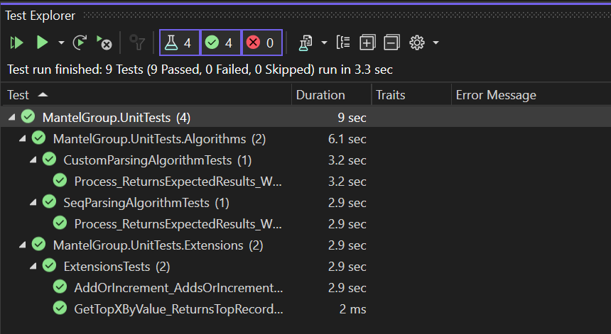

# Mantel Group - Log Parser

A fast and efficient log parsing tool designed

## Choice of CSV Parser

The choice of CSV parser was done after looking at some benchmarks provided by the open source community. See [Benchmark CSV Parsers](https://www.joelverhagen.com/blog/2020/12/fastest-net-csv-parsers)

## Data Analysis

Data analysis shows that the data has 10 columns (with the exception of line 12 which has addditional columns):

## Performance Test Results

Performance tests compared different approaches:

Seq came up on top due to its usage of Structs and no Gen1 variables. In order to make Seq testable, one would have to write a wrapper and then inject it into the algorithm class.

Unit tests were also written on CustomParsingAlgorithm to demonstrate testable classes.

## How Tos

Note: Data folder with the file named:
`programming-task-example-data.txt`
is expected alongside the executable

In the case where the file is not found, the following error will be shown:

- To run the benchmarks (MantelGroup.BenchmarkTests):
  - Open Terminal and Nagivate to `[ProjectRoot]/tests/MantelGroup.BenchmarkTests`
  - Run `dotnet run -c Release`
- To run the Console Project (MantelGroup.LogParser):
  - Open Terminal and Nagivate to `[ProjectRoot]/tests/MantelGroup.BenchmarkTests`
  - Run `dotnet run -c Release`
    
- To run the Unit Tests (MantelGroup.UnitTests):
  - Open Terminal and Navigate to `[ProjectRoot]/tests\MantelGroup.UnitTests`
  - Run `dotnet test` to execute tests
    or `dotnet test -v n` to execute with logs

Alternatively, you can run from VS or any other IDE as well.

## Demontrate

- [x] Unit testing with xUnit, Moq, Bogus, File based data sets, mock setups and verifications,
- [x] Benchmark testing for all algorithms
- [x] Multiple algorithms using thrid party nugets and custom implementations
