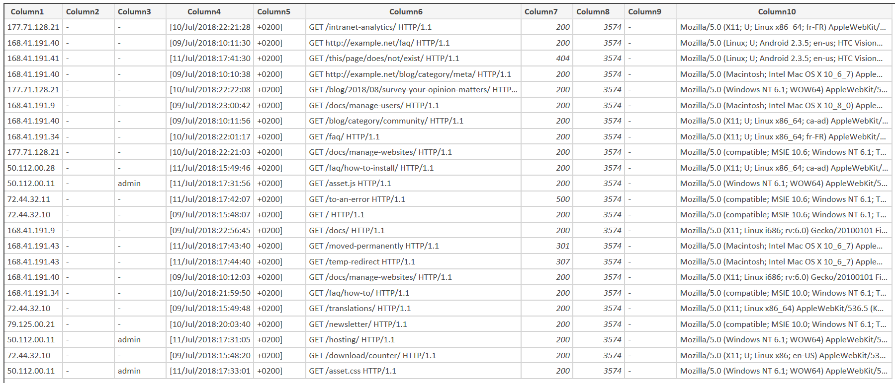
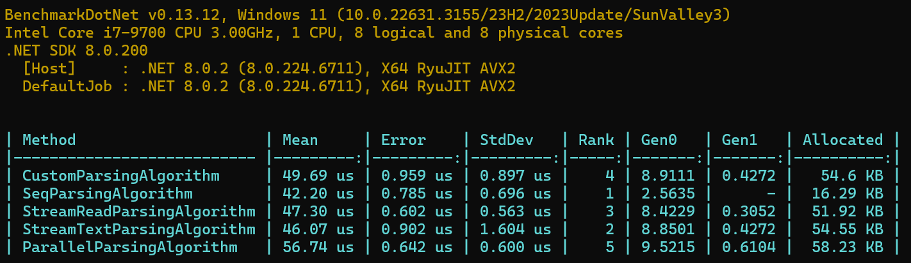

# Mantel Group - Log Parser

A fast and efficient log parsing tool designed

## Choice of CSV Parser

The choice of CSV parser was done after looking at some benchmarks provided by the open source community. See [Benchmark CSV Parsers](https://www.joelverhagen.com/blog/2020/12/fastest-net-csv-parsers)

## Data Analysis

Data analysis shows that the data has 10 columns if we use the space delimiter. However, notice how the date time offset is parsed as two separate columns due to the lack of multiple unescaping characters. The workaround applied was to load the csv as is and combine the two columns when reading to still be performant.

## Performance Test Results

Performance tests compared different approaches:

Since Seq came up on top due to its usage of Structs and Gen0 variables, all unit tests were written on that algorithm.
